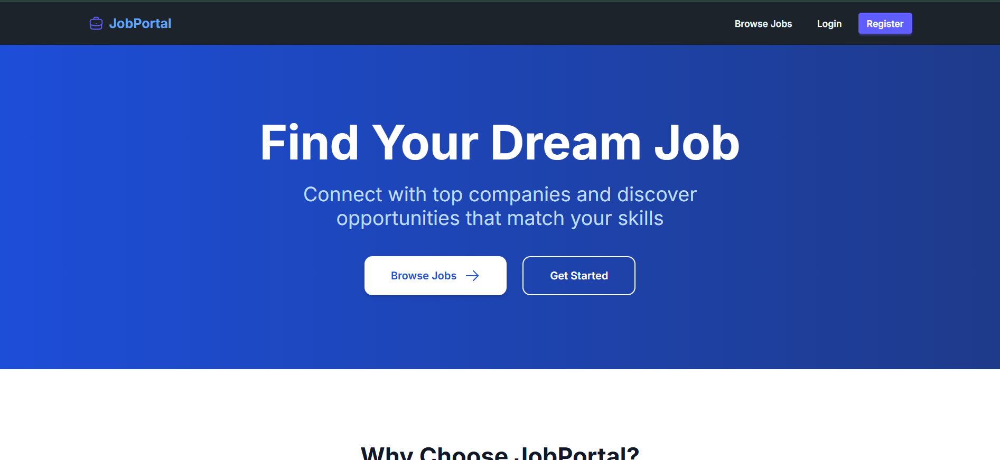
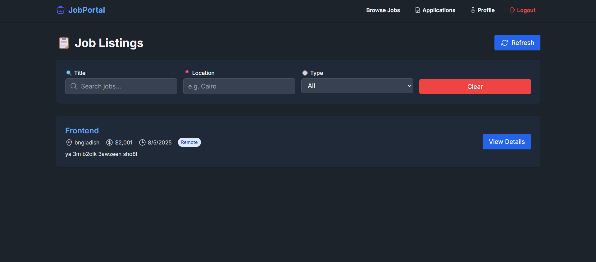
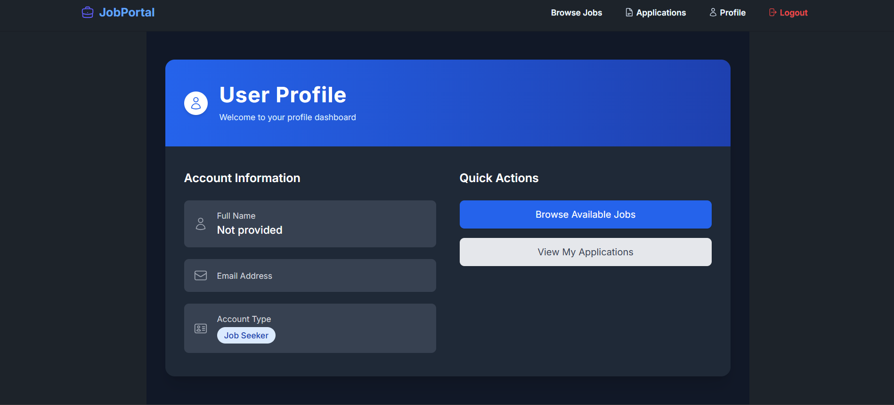

LinkedIn Recruitment System
A full-stack recruitment platform inspired by LinkedIn, built with Node.js, Express, MongoDB, React (Vite), and TailwindCSS.
The system allows companies to post jobs, candidates to apply with resumes, and includes role-based access control for different user types.

🚀 Features

1. Authentication & Authorization
   Secure JWT-based login & registration
   Role-based access: Company & Candidate
   Profile management for both roles

2. Job Management
   Companies can create, edit, and delete job postings
   Job listings with filters and pagination
   Companies can only manage their own jobs

3. Application System
   Candidates can apply to jobs
   Resume upload with Multer
   Companies can view and download applications

🛠 Tech Stack

Backend
Node.js, Express.js
MongoDB + Mongoose
JWT Authentication
Multer for file uploads

Frontend
React (Vite)
TailwindCSS + PostCSS
Axios for API calls

📂 Project Structure

LINKEDIN/
│
├── backend/
│ ├── config/ # Database & environment config
│ ├── controllers/ # Request handling logic
│ ├── middleware/ # Auth & validation middleware
│ ├── models/ # Mongoose schemas
│ ├── routes/ # API route definitions
│ ├── uploads/ # Resume uploads (ignored in git)
│ ├── app.js # Express app entry point
│ ├── package.json
│ └── .env # Environment variables
│
├── frontend/
│ ├── src/ # React components & pages
│ ├── index.html
│ ├── package.json
│ ├── tailwind.config.js
│ └── vite.config.js
│
└── README.md

⚙ Installation & Setup

    1️⃣ Clone the Repository
        git clone https://github.com/<your-username>/linkedin-recruitment-system.git
        cd linkedin-recruitment-system

    2️⃣ Backend Setup
        cd backend
        npm install
    Create a .env file inside backend/:
        PORT=5000
        MONGO_URI=your_mongodb_connection_string
        JWT_SECRET=your_jwt_secret

Run backend:
npm start

3️⃣ Frontend Setup
cd ../frontend
npm install
npm run dev

## 📸 Screenshots

| Home Page                     | Job Listing                          |
| ----------------------------- | ------------------------------------ |
|  |  |

| Profile Page                        |
| ----------------------------------- |
|  |
